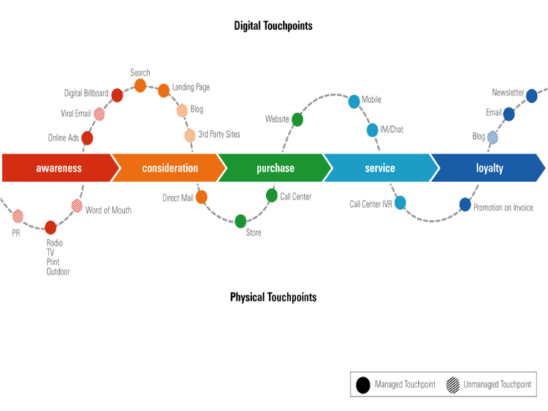

# Content Chân Kinh

## Lời giới thiệu

Chào bạn,

Chúng ta vừa bước qua giai đoạn **"Content is King"** và sang trang mới **"Content is Queen"**! Content ngày càng đóng vai trò quan trọng trong kinh doanh và marketing:

- Bán hàng bằng content
- Viral bằng content
- Thu hút khách bằng content hữu ích (gọi là content marketing)
- SEO bằng content chất lượng
- Tăng tương tác fanpage bằng content trúng insight

Tạo được content hay là bí quyết để bán hàng online, là cách để viral, là cách để giảm chi phí, là cách để chiến thắng với nguồn lực giới hạn.

Ebook **Content Chân Kinh** này chính là bí kíp giúp bạn tạo ra content hay. Content Chân Kinh là tập hợp các bài viết hay nhất của mình về content đã chia sẻ trên các cộng đồng như iSocial, Quản Trị và Khởi Nghiệp, Thánh Content. Trong đó có nhiều bài viết nhận được hơn một ngàn like, và đã lan truyền trên nhiều website.

Đây là những kinh nghiệm mà mình góp nhặt được trong nhiều năm qua từ thực tiễn và từ sách vở.

Mình chia sẻ kiến thức với hi vọng bạn đọc nhận được giá trị, để làm đúng hướng, còn bản thân mình nhờ viết ra sẽ trở nên tiến bộ hơn. Sau khi viết những bài này cũng có nhiều bạn inbox: “anh ơi nhờ những bài viết của anh, em đã đọc và thực hành, kết quả rất khả quan ạ”. “Anh ơi cám ơn anh đã chia sẻ những toàn những điều bổ ích”. Đó là điều làm mình vui nhất khi viết ra những bài viết này.

Tập hợp các bài viết vào ebook này sẽ giúp bạn dễ dàng tìm kiếm hơn, tranh thủ đọc lúc rảnh rỗi.. Hoặc cứ xem như một quà tặng mình dành tặng bạn, để minh biết còn có ai đó thỉnh thoảng đọc bài viết của mình. So với các bài viết trên các group thì phiên bản ebook này có thêm minh họa hình bằng các hình ảnh bắt mắt. Xin gửi lời cảm ơn đến bạn Nguyễn Minh Tú phụ trách thiết kế và gửi lời cảm ơn đến bạn Nguyễn Đình Cát Tiên phụ trách biên tập.

Ngoài ra mình còn dành tặng một phần quà cực kỳ đặc biệt nằm ở vị trí “bí ẩn” trong ebook. Hãy đọc thật kỹ ebook để tìm ra phần quà này nhé!
Cuối cùng xin chân thành gửi lời cảm ơn bạn đã quan tâm đọc, đã like, đã comment bài viết của mình để nhiều người biết đến. Cảm ơn bạn đã chia sẻ lại bài viết trên website, trên Facebook và không quên ghi nguồn. Đó là động lực lớn để mình có thể tiếp tục chia sẻ nhiều hơn nữa!

Sắp tới mình sẽ cho ra mắt thêm hai ebook nữa về Facebook Ads và các Mẹo tư duy, viết content. Các bạn hãy đón đọc nhé!
Xin cảm ơn.
Hoàng Bảo Kiếm

---

## Mục lục

### [PHẦN I] ĐỂ TRỞ THÀNH THÁNH CONTENT BÁN HÀNG

- **Bài 1:** Cấu trúc của một content hay
- **Bài 2:** Mức độ hay (MDH) của bài viết
- **Bài 3:** Tạo ra sự khác biệt cho content
- **Bài 4:** Giá trị - yếu tố cốt lõi của một content hay
- **Bài 5:** Đưa giá trị vào content là cách để làm content hay hơn
- **Bài 6:** Làm thế nào để content cuốn hút?
- **Bài 7:** Cách giữ nhịp content cuốn hút từ đầu đến cuối
- **Bài 8:** Vai trò của cảm xúc trong content

### [PHẦN II] TƯ DUY VỀ CONTENT

- **Bài 1:** Tư duy trước content
- **Bài 2:** Tư duy trong content
- **Bài 3:** Tư duy sau content

### [PHẦN III] CÔNG THỨC TIÊU ĐỀ DỄ DÀNG MÀ LẠI HIỆU QUẢ

### [PHỤ LỤC] HOT KEYWORDS

---

# [PHẦN I] ĐỂ TRỞ THÀNH THÁNH CONTENT BÁN HÀNG


## Thánh Content là gì?

**Thánh Content** là người viết content hay. Hay đến nỗi người đọc phải:

- Chăm chú đọc từ đầu đến cuối bài cho dù nó dài thế nào
- Dừng xem tivi để đọc nó
- Dừng tán gẫu để đọc nó
- Dừng làm việc để đọc nó
- Nói chung là dừng mọi thứ xung quanh để nghiền ngẫm nó

**Thánh Content bán hàng** là người viết content hay và khiến khách hàng đọc xong phải hành động như người viết mong muốn: mua hàng, để lại contact, comment, inbox, like, share.

Như vậy cần có **2 điều kiện**:

1. Viết content hay
2. Content phải khiến người đọc hành động

## Tại sao cần trở thành Thánh Content bán hàng?

Bạn phải trở thành Thánh Content bán hàng hoặc phải thuê được Thánh Content bán hàng vì:

### 1. Tăng doanh số bán hàng

- Với cùng một số lượng người đọc, content hay sẽ cho tỉ lệ chuyển đổi cao hơn content bình thường
- Cao hơn nhiều so với content dở

### 2. Content đang lên ngôi

- **Facebook:** ưu tiên content thú vị, cho nó tiếp cận nhiều người hơn → giảm chi phí quảng cáo
- **Google:** content hay giúp bài viết đứng ở thứ hạng cao trong danh sách tìm kiếm

**Tóm lại:** Content hay sẽ giúp bạn bán được hàng và giảm chi phí tiếp cận khách hàng mới.

---

## Bài 1: Cấu trúc của một content hay


Theo quan điểm cá nhân của tôi, một content hay gồm có **3 phần**:

### 1. Ngôn từ hay

Ngôn từ là từ ngữ diễn đạt thành lời, thành văn bản. Ngôn từ chính là vỏ bọc của nội dung.

#### Dùng từ tượng hình

Từ tượng hình là từ gợi lên hình ảnh trong tâm trí người đọc, làm người đọc hình dung ra cảnh tượng chân thực.

| Từ ngữ bình thường   | Từ tượng hình              |
| -------------------- | -------------------------- |
| Cô ấy buồn           | Cô ấy rơi nước mắt         |
| Anh ấy có nhiều tiền | Anh ấy đếm tiền mỏi cả tay |
| Hồi hộp              | Tim đập thình thịch        |

#### Ví dụ Hot Keywords:

- Bóc phốt - Đánh ghen - Nghe lén - Bói toán
- Mất trộm, mất cắp
- Dì ghẻ, con chồng
- Người chồng bất lực
- Ông hàng xóm
- Thả ga

#### Ví dụ tiêu đề có vần:

- "Trang sức cực xinh, tôn vinh nét quý phái"
- "Xinh xinh cute cute trông thật đáng yêu"

### 2. Phép tu từ hay

#### 2.1 Sóng đôi

Một cặp câu, cặp mệnh đề đều nhằm ám chỉ hay mang đến cùng một ý nghĩa. Phép sóng đôi nhờ lặp lại cùng ý nghĩa nên làm tăng gấp đôi cảm xúc của người đọc.

**Ví dụ:** Trích đoạn bài "Hịch tướng sĩ":

> "Chẳng những thái ấp của ta không còn, mà bổng lộc của các ngươi cũng mất"
>
> "Chẳng những gia quyến của ta bị tan, mà vợ con các ngươi cũng khốn"

#### 2.2 Phép tương phản

Nghệ thuật dùng 2 hình ảnh, 2 chi tiết đối lập để khắc họa đậm nét hơn một vấn đề.

**Ví dụ:** So sánh ưu nhược điểm người trẻ vs người già dặn:

**Ưu điểm của người trẻ:**

- Giàu năng lượng, đầy nhiệt huyết
- Tính sáng tạo cao, tư tưởng phóng khoáng
- Dũng cảm, gan dạ, xông pha

**Nhược điểm:**

- Thiếu kiến thức, thiếu kinh nghiệm
- Thiếu khả năng kiềm chế cảm xúc tiêu cực
- Thiếu tài chính và thiếu lực lượng ủng hộ

### 3. Ý tưởng hay


Ý tưởng bài viết bao gồm: Viết cái gì? Viết thế nào? Nên đưa thông tin gì? Trình bày ý nào trước, ý nào sau?

> Ý tưởng chiếm hơn **70%** sự thành công của bài viết bán hàng. Và nó là phần quan trọng nhất trong 3 yếu tố.


---

## Bài 2: Mức độ hay (MDH) của bài viết

### Thế nào là mức độ hay?

Để đánh giá khách quan mức độ hay của bài viết, bạn phải để người đọc đánh giá.


**Công thức tính MDH:**

```
MDH = (Số comment + Số share) / Số like × 100%
```

### Thang đánh giá:

| MDH  | Mức độ                      |
| ---- | --------------------------- |
| 10%  | Hay (mức trung bình)        |
| ≥15% | Hay hay (trung bình khá)    |
| ≥20% | Khá hay                     |
| ≥25% | Rất hay                     |
| ≥30% | Hay tuyệt vời               |
| ≥50% | Quá xuất sắc (hoặc seeding) |

### Lưu ý:

- Công thức không áp dụng cho bài viết dạng hỏi đáp/khảo sát
- Không áp dụng cho bài viết gây phẫn nộ
- Cần xem sơ qua comment để loại bỏ các trường hợp ngoại lệ

### Ý tưởng hay được tạo nên từ:

- **Khác biệt**
- Giá trị
- Cảm xúc
- Thống nhất
- Cuốn hút
- Trải nghiệm
- Lý trí

---

## Bài 3: Tạo ra sự khác biệt cho content


### 1. Thay đổi điểm nhấn trong bài viết

Thay vì viết về 5 ưu điểm trong một bài dài 500 từ, hãy tập trung vào 1 đặc điểm trong bài viết 500 từ. Người đọc sẽ ấn tượng rất mạnh.

**Ví dụ:** So sánh hai cô gái:

- **Cô Hoàn Hảo:** 5 ưu điểm (xinh đẹp, thông minh, nhà giàu, gia đình quyền thế, hiền lành)
- **Cô Chỉ Đẹp:** Tập trung vào 1 ưu điểm (xinh đẹp) nhưng mô tả chi tiết, sinh động

### 2. Thay đổi góc nhìn về sản phẩm


#### Các góc độ có thể sử dụng:

- **Góc độ người sản xuất:** quy trình sản xuất, nguyên vật liệu, nguồn hàng
- **Góc độ người bán hàng:** khách mua nhiều như thế nào, hết hàng ra sao
- **Góc độ sản phẩm:** đặc tính, chất lượng, giá cả, ích lợi
- **Góc độ khách hàng:** feedback, ích lợi khi sử dụng
- **Góc độ thời gian:** thời gian sản xuất, sử dụng, tiết kiệm thời gian
- **Góc độ lý tính:** phân tích logic tính năng
- **Góc độ cảm tính:** lợi ích về mặt cảm xúc
- **Góc độ tài chính:** tiết kiệm tiền, kiếm thêm tiền, thanh toán dễ dàng
- **Góc độ giáo dục:** hướng dẫn, chia sẻ kiến thức hữu ích
- **Góc độ nhân quả:** nguyên nhân & kết quả
- **Góc độ sức khỏe:** ảnh hưởng đến sức khỏe

### 3. Thay đổi cách diễn đạt

#### Các phương pháp:

- **Liệt kê:** ngắn gọn, xúc tích, mỗi ý là một đầu dòng
- **Kể chuyện:** mọi người đều yêu thích nghe chuyện hấp dẫn
- **Nhân hóa:** hóa thân vào sản phẩm, cho nó có đặc tính con người
- **Làm thơ:** vài câu đầu có vần, như vè, như rap

### 4. Thay đổi cách tiếp cận SP/DV


- Nêu vấn đề trước, rồi chỉ ra sản phẩm như giải pháp
- Đặt tiêu chuẩn cao rồi chỉ ra sản phẩm là giải pháp đạt được tiêu chuẩn đó
- Từ tổng thể đến chi tiết hoặc ngược lại
- So sánh với loại thông thường để làm nổi bật giá trị

### 5. Dùng thủ thuật sao chép sáng tạo

**Sáng tạo sao chép** là phương pháp sao chép ý tưởng từ một nơi khác để tạo ra sáng tạo đột phá.

**Ví dụ:**

- iPhone = sao chép tính thẩm mỹ vào ngành công nghệ
- Võ thuật Trung Quốc = sao chép tư thế động vật (Hổ Quyền, Xà Quyền)
- Máy tính = sao chép cách xử lý thông tin của con người

**Áp dụng vào content:**
Sao chép từ ý tưởng, tiêu đề, câu nói, cách diễn đạt từ nguồn thông tin hay (bài viết, bài hát, phim, câu nói nổi tiếng) về bài viết của bạn.

---

## Bài 4: Giá trị - yếu tố cốt lõi của một content hay


Một content trở thành hay khi nó mang lại **giá trị** cho người đọc. Giá trị càng cao, content càng hay.

### Giá trị của một content bao gồm:

#### 1. Giá trị sản phẩm

Sản phẩm phải mang lại giá trị cho khách hàng như:

- Giúp giải quyết vấn đề
- Mang lại điều họ mong muốn
- Tạo sự khác biệt so với đối thủ

**Ví dụ:**

- Quần áo → đẹp hơn, trẻ trung hơn, phong cách hơn
- Điện thoại → sang trọng đẳng cấp, công cụ bán hàng, selfie, chơi game

#### 2. Giá trị giải trí

Bao gồm sự lôi cuốn, hài hước, hồi hộp, thú vị... Giải trí giúp:

- Quên đi sự lo toàn, vất vả của cuộc sống
- Cuộc sống bớt nhàm chán
- Tô điểm cho cuộc sống hằng ngày

#### 3. Giá trị hiểu biết

Mang lại kiến thức, sự hiểu biết mới cho người đọc. Tất cả content dạng giáo dục, hướng dẫn đều thuộc dạng này.

#### 4. Giá trị cảm xúc

Trong tất cả các giá trị, **cảm xúc** là thứ được con người coi trọng nhất. Các loại cảm xúc:

- Tích cực: vui sướng, tự hào, tin tưởng, cảm động, đồng cảm, thích thú, hi vọng
- Tiêu cực: sợ hãi, tức giận, buồn, chán ghét

> **Lưu ý:** Giá trị phải được cảm nhận ở nơi người đọc, không phải ở nơi tác giả.

---

## Bài 5: Đưa giá trị vào content là cách để làm content hay hơn

### 1. Giá trị sản phẩm

Để làm nổi bật giá trị sản phẩm:

- Hướng đến nhu cầu của khách hàng
- Những mong muốn ẩn sâu bên trong (insight)
- Đảm bảo những gì nói đủ khác biệt

**Ví dụ sai lầm thường gặp:**

```
"Đây là mái nhà của trang phục mang chủ đề thiên nhiên gắn liền với phong cách đương đại..."
```

**Cách viết đúng (tập trung vào khách hàng quan tâm):**

```
"Xinh đẹp, quyến rũ, khiến bao chàng phải mất ngủ..."
"Xinh tôn dáng, mặc đáng đồng tiền..."
"Đã nhìn là thấy mê, đã mặc thì đẹp khỏi chê..."
```

### 2. Giá trị giải trí

Dùng cách kể chuyện hoặc đưa tính hài hước vào content.

**Ví dụ kể chuyện bán tinh bột nghệ:**

```
- Anh yêu! Anh nhớ uống tinh bột nghệ nhé!
- Em có để tinh bột nghệ pha sẵn mật ong để ở trong tủ...
- Nếu anh nhớ lời em dặn dùng đều đặn 3 lần mỗi ngày thì hết tuần này bao tử anh sẽ khỏe lại ngay!
- Tối nay không được đi nhậu nữa nhé...
```

Người đọc vừa hiểu được giá trị sản phẩm (trị bệnh bao tử, giảm cân) vừa cảm thấy thú vị khi đọc.

### 3. Giá trị hiểu biết

Mang kinh nghiệm thực tế vào content để tạo sự tin tưởng.

**Ví dụ bán tôm khô:**

```
"Tôm khô Nhà bà Quyên - tôm khô truyền thống gia đình. Có kinh nghiệm làm tôm khô hơn 30 năm.
Tôm đất thiên nhiên, tự sinh, tự sống, vừa bắt lên còn tươi thì luộc liền, luộc trong lửa thật to để vỏ tôm phồng ra..."
```

### 4. Giá trị cảm xúc

**Ví dụ 4 câu thần thánh cho bikini:**

```
Đã tắm thì phải trăm người ngắm
Đã bơi thì phải xinh ngất trời
Đã mặc bikini thì phải thật sexy
Bạn sẽ làm được như trên nếu diện những mẫu bikini HOT dưới đây!
```

**Phân tích cảm xúc:**

- **Vui sướng:** tưởng tượng cảnh được nhiều người ngắm
- **Tự hào:** về sự xinh đẹp
- **Thích thú:** vì phóng đại hài hước ("trăm người", "ngất trời")
- **Hi vọng:** muốn làm được như vậy
- **Đồng cảm:** cùng mong muốn

---

## Bài 6: Làm thế nào để content cuốn hút?


Để người đọc hết nội dung từ đầu đến cuối:

> **Câu đầu tiên** (tiêu đề) phải thu hút để người đọc đọc **câu thứ 2** > **Câu thứ 2** phải hấp dẫn để người ta đọc **câu thứ 3** > **Câu thứ 3** phải hấp dẫn để người ta đọc **câu thứ 4**
> ...cho đến khi đọc hết **đoạn đầu tiên**

### Hãy đánh vào:

#### 1. Trí tò mò của độc giả

Con người tò mò những gì họ chỉ biết **1 phần**. Nghĩa là 1 phần biết, 1 phần chưa biết mới gây tò mò.

**Ví dụ:**

- "Vì sao con gái nên mặc váy?" → biết "con gái nên mặc váy", chưa biết "vì sao"
- "Chàng trai chuẩn bị màn tỏ tình công phu và cái kết đầy tủi hờn" → biết có tỏ tình và kết quả xấu, chưa biết cụ thể như thế nào

**Áp dụng cho quảng cáo:**

- "Cứ 10 người dùng sản phẩm này thì 9 người trở thành khách hàng trung thành"
- "Tôi vừa bị shop [TÊN_SHOP] lừa mất 500K"
- "Nhìn là mê - ăn là ghiền"

#### 2. Lợi ích

Hứa hẹn mang lại lợi ích hấp dẫn cho người đọc.

**Ví dụ:**

- "Phụ nữ nên làm gì để vừa xinh đẹp vừa kiếm được nhiều tiền?"
- "Hết mụn sau 3 ngày, hết thâm sau 2 tuần, bảo hành vĩnh viễn"
- "KEM HÀN QUỐC MỚI: VỪA NGON, VỪA BẢO VỆ SỨC KHỎE"

#### 3. Khác biệt

Content phải khác với những gì người đọc đã từng thấy, nghe.

#### 4. Cảm xúc và trải nghiệm

Cảm xúc là động cơ của hành động. Khi tạo được cảm xúc tích cực, người đọc sẽ tiếp tục đọc.

**Ví dụ quảng cáo thuốc bổ sung cho bà mẹ:**

```
"Nhìn ngắm con yêu chào đời là giây phút thiêng liêng nhất của mẹ.
Cho con đầy đủ dinh dưỡng để khỏe mạnh & thông minh là việc làm đúng đắn nhất mà các mẹ nên làm"
```

---

## Bài 7: Cách giữ nhịp content cuốn hút từ đầu đến cuối


### 1. Đánh vào trí tò mò của độc giả

Tạo tính cuốn hút ở:

- Tiêu đề
- Đoạn văn đầu tiên
- Phần liên kết giữa các đoạn

Giống như tiểu thuyết nhiều chương: gần cuối chương có sự kiện kịch tính, phải qua chương kế tiếp mới biết kết quả.

### 2. Hứa hẹn mang lại rất nhiều lợi ích

Hứa hẹn lợi ích ở phần đầu (tiêu đề/mở bài) nhưng phải khác biệt để tránh nhàm chán.

### 3. Cảm xúc và trải nghiệm

**Ví dụ quảng cáo thuốc bổ sung cho bà mẹ:**

```
"Nhìn ngắm con yêu chào đời là giây phút thiêng liêng nhất của mẹ.
Cho con đầy đủ dinh dưỡng để khỏe mạnh & thông minh là việc làm đúng đắn nhất mà các mẹ nên làm"
```

Câu đầu khơi gợi cảm xúc yêu thương, câu sau thúc đẩy hành động.

---

## Bài 8: Vai trò của cảm xúc trong content


### Tại sao cảm xúc quan trọng?

**Cảm xúc** là biểu hiện của **bản năng sinh tồn** - thứ đã được "cài sẵn" trong cơ thể con người từ hàng nghìn năm trước.

#### Ví dụ về cơ chế cảm xúc:

**Khi giận dữ:**

- Mắt long lên → đe dọa kẻ thù
- Tim đập nhanh → bơm máu, lấy năng lượng cho cơ thể
- Chuẩn bị cho trận chiến

**Khi sợ hãi:**

- Tim đập nhanh → lấy năng lượng để chạy thoát thân
- Hoặc không cử động → giả chết để tránh kẻ thù

### Định nghĩa khoa học:

> "Cảm xúc là một xung thần kinh chuyển cơ thể thành hành động, thúc đẩy hành vi phản ứng tự động, đó là cơ chế sống còn để thỏa mãn nhu cầu sống còn"

### Mối quan hệ giữa cảm xúc và hành động:

**Cảm xúc** = **Trạng thái chuẩn bị hành động**

- Cảm xúc càng mạnh → hành động càng mạnh
- Muốn khách có hành động (mua hàng, comment, share) → phải đưa họ vào trạng thái cảm xúc

### Cơ chế thưởng phạt:

**Bản năng sinh tồn** tạo ra:

- **Cảm xúc tích cực** (sung sướng, thoải mái, dễ chịu) → khuyến khích tiếp tục hành vi
- **Cảm xúc tiêu cực** (đau đớn, khó chịu) → răn đe tránh xa hành vi đó

---

# [PHẦN II] TƯ DUY VỀ CONTENT


Content thành công cũng nhiều, thất bại cũng không ít. Nguyên nhân của nhiều content thất bại là **"Tay nhanh hơn não"**.

Thiết lập tư duy trước khi làm content giúp:

- Loại bỏ hơn 70% vấn đề
- Content có tính chiến lược
- Đi trên con đường chiến thắng

## Bài 1: Tư duy trước content

### 1. Chúng ta đang có gì?

Sản phẩm/dịch vụ của bạn có gì khác biệt so với đối thủ?

- **Nếu CÓ:** content sẽ dễ dàng, chỉ cần mô tả sản phẩm
- **Nếu KHÔNG:** hãy làm cho content khác biệt. Học hỏi từ Coca-Cola, sản phẩm không có gì mới nhưng cách quảng cáo luôn mới và thú vị.

### 2. Thị trường như thế nào? Đối thủ đang làm gì?

- **Thị trường bỏ ngỏ:** làm content dễ dàng
- **Cạnh tranh khốc liệt:** cần xem đối thủ đang làm gì, tránh cuộc đua giá

### 3. Khách hàng muốn gì và muốn gì ở sản phẩm?

Khách hàng quan tâm đến:

- Giá rẻ
- Có ai đó hiểu họ, hiểu vấn đề của họ
- Giải quyết được vấn đề

**Ví dụ ngành spa:**
Khách hàng lo sợ:

- Giảm giá có thể làm chất lượng giảm
- Bị chèo kéo mua thêm sản phẩm khác
- Nghi ngờ tính chân thực

→ Nếu hiểu và nói lên nỗi lo này, khách sẽ tin tưởng bạn hơn

### 4. Bạn - người làm content - có gì?

Khai thác điểm mạnh của mình:

- **Giỏi kể chuyện** → hãy kể chuyện
- **Giỏi phân tích** → hãy phân tích
- **Giỏi mô tả** → hãy mô tả
- **Giỏi thấu hiểu insight** → hãy khai thác insight
- **Không giỏi văn** → chỉ cần liệt kê, viết như nói

---

## Bài 2: Tư duy trong content


### Phần 1: Tư duy cơ bản

#### 1. Ngôn ngữ

**Cách học:** Đọc nhiều và xem nhiều

- Sách về kỹ năng, tâm lý, khoa học, kinh doanh
- Phim, truyện, tiểu thuyết

**Lưu ý:** Ngôn từ chỉ là kỹ năng nhập môn. Kỹ năng đỉnh cao là **thấu hiểu khách hàng**.

#### 2. Hình ảnh

Khi viết, làm cho khách hàng thấy được hình ảnh hiện trước mắt.

**Ví dụ:**

- Thay vì: "Đôi tình nhân đang thể hiện tình yêu thương"
- Viết: "Đôi tình nhân đi bên nhau, tay trong tay, tình trong mắt"

#### 3. Âm thanh

Khi đọc, khách sẽ đọc thầm và âm thanh vang trong đầu họ.

**Lưu ý:**

- Dùng từ dễ phát âm
- Hạn chế từ khó đọc
- Tránh từ trùng âm nhưng khác nghĩa

**Ví dụ:** Không dùng "siêu xinh" (trùng âm "siêu sinh"), thay bằng "siêu đẹp" hoặc "cực xinh"

#### 4. Tâm lý học

Hiểu biết về tâm lý giúp content phù hợp với khách hàng:

**Phụ nữ:**

- Sống tình cảm, quyết định bằng cảm xúc
- Yêu trẻ con (bản năng làm mẹ)
- Thích mua sắm và món hời
- Là lực lượng chính của nền kinh tế

**Đàn ông:**

- Thường quyết định bằng lý trí

**Tâm lý chung:**

- **Phi lý trí:** chấp nhận tăng giá từ 100K→105K hơn là 10K→15K
- **Tâm lý đám đông:** tin khi thấy nhiều người khác đã tin

#### 5. Yếu tố xã hội

- **Xưa:** thích lời thơ nhẹ nhàng
- **Nay:** nhịp độ công nghiệp → cần đi thẳng vào vấn đề, ngắn gọn xúc tích

### Phần 2: Tư duy Marketing 7Ps


#### 1. Product (Sản phẩm)

Trình bày giá trị sản phẩm mang lại cho khách hàng.

**Ví dụ đồ chơi gỗ trẻ em:**

- Rèn luyện đôi tay khéo léo và linh hoạt
- Phát huy khả năng tư duy và sáng tạo
- Tăng khả năng giao tiếp, tình cảm anh chị em

#### 2. Price (Giá cả)

Chứng minh mức giá là hời:

**Nếu giá rẻ nhất:** Chỉ ra số tiền ít nhất trong một lần mua

**Nếu giá cao:** Phân tích xem nhìn từ khía cạnh nào thì nó rẻ hơn. Ví dụ giá bạn bán với giá 1 triệu đồng, xài được 5 năm vì sản phẩm tốt, trung bình mỗi năm tốn 200K. So sánh với mặt hàng khác chỉ 500K nhưng chỉ xài được 2 năm, trung bình mỗi năm tốn 250K, rõ ràng là mắc hơn so với sản phẩm của bạn.

Bạn cũng có thể so sánh mức giá khách bỏ ra với mức chi phí họ tiết kiệm được nhờ sản phẩm của bạn mang lại hoặc số tiền mà khách sẽ kiếm được từ ích lợi sản phẩm bạn mang lại.

#### 3. Promotion (Khuyến mãi)

- Mua 2 tặng 1
- Tặng kèm sản phẩm khác
- Lời nói tốt của khách hàng/người nổi tiếng

#### 4. Places (Phân phối)

Giải thích sự tiện lợi:

- Giao hàng nhanh (nếu bán địa phương)
- Xem hàng trực tiếp
- Đổi trả dễ dàng
- Hệ thống phân phối rộng → thể hiện sức mạnh tài chính

#### 5. People (Nhân sự)

Chứng minh kỹ năng, trình độ:

- Bằng cấp, giải thưởng
- Số năm kinh nghiệm
- Dự án thành công
- Uy tín, thương hiệu

#### 6. Process (Quy trình)

Thể hiện sự chuyên nghiệp:

**Ví dụ quy trình viết content:**

```
Tìm hiểu sản phẩm → Phân tích SWOT → Phân tích đối tượng →
Lên ý tưởng → Viết bài → Kiểm tra tính thu hút →
Kiểm tra tính marketing → Release
```

#### 7. Philosophy (Triết lý)

Quan niệm sống trong kinh doanh:

- Mang giá trị đến cộng đồng
- Cam kết làm từ thiện
- Triết lý được nhiều người kính phục

#### Phép lặp

Lặp lại để tạo nên content hay:

- Lặp âm, lặp từ → tạo vần
- Lặp cấu trúc câu → tạo phép sóng đôi
- Lặp lại tư duy và quy trình
- Lặp lại việc viết content cho đến khi đạt yêu cầu

---

## Bài 3: Tư duy sau content


### Kiểm chứng content

Sau khi post content, đừng đánh giá chủ quan. Hãy sử dụng:

#### Công thức MDH:

```
MDH = (Số comment + Số share) / Số like × 100%
```

- **MDH ≥ 10%:** Content hay rồi
- **Chưa đủ người tiếp cận:** Không áp dụng được công thức

### Cách kiểm chứng:

1. **Đưa cho một số người quan tâm đánh giá** (tính chủ quan)
2. **Post lên Facebook cá nhân**
3. **Post lên Fanpage với hạn chế đối tượng** (theo độ tuổi, vị trí, sở thích)

### Học hỏi từ kết quả:

#### Khi content thành công:

- **Đặt câu hỏi:** Nó hay nhờ yếu tố nào?
- **Ghi vào sổ tay** các yếu tố thành công
- **Kiểm chứng** với content khác

#### Khi content thất bại:

- **Phân tích nguyên nhân** thất bại
- **Đặt giả định** và kiểm chứng

### Nguyên tắc học tập:

> **Mỗi ngày phải học được một điều ĐÚNG**

**Tại sao "điều đúng" quan trọng?**

- Học 1 điều đúng > học 10 điều sai
- Điều đúng là nền tảng để học điều đúng khác
- Môi trường tôn vinh giá trị đúng sẽ giúp tiến bộ nhanh hơn

**Ví dụ:**

- Học tiếng Anh 11 năm ở Việt Nam < 3 năm ở Nhật
- Người ra nước ngoài thường giỏi hơn vì học được "điều đúng"

### Quy trình tự học:

1. **Đặt câu hỏi** sau mỗi content (thành công hay thất bại)
2. **Đưa ra giả định** về nguyên nhân
3. **Ghi chép lại** những phát hiện
4. **Kiểm chứng** với content tiếp theo
5. **Rút ra quy luật** từ những điều đúng

---

# [PHẦN III] CÔNG THỨC TIÊU ĐỀ DỄ DÀNG MÀ LẠI HIỆU QUẢ


## Công thức:

```
[Tính từ/Trạng từ] hơn, [Tính từ/Trạng từ] hơn!
```

## Ví dụ áp dụng:

### Thời trang:

- "**Đẹp hơn, rẻ hơn!**"

### Nước hoa:

- "**Thơm hơn, lưu hương lâu hơn**"

### Công nghệ:

- "**Nhanh hơn, bền vững hơn**"

### Sản phẩm vệ sinh:

- "**Mỏng hơn, thấm hút nhanh hơn**"

## Tại sao hiệu quả?

### 1. Thể hiện ưu thế

Cho khách biết sản phẩm hơn đối thủ ở đâu (giá, chất lượng, tính năng)

### 2. Đánh vào mong muốn

Ai cũng muốn có sản phẩm chất lượng hơn hoặc giá rẻ hơn

### 3. Tác động kép

2 mệnh đề liên tục → sản phẩm hơn đối thủ đến 2 tính chất

### 4. Không giới hạn so sánh

Dùng "hơn" nhưng không nói "hơn ai" → người đọc hiểu là hơn tất cả

## Lưu ý khi sử dụng:

- **Phân tích sản phẩm** trước khi áp dụng
- **Làm cho đúng:** giá cao thì không ghi "rẻ hơn"
- **Chọn tính chất phù hợp** với thực tế sản phẩm
- **Kết hợp với hình ảnh** để tăng độ tin cậy

---

# [PHỤ LỤC] HOT KEYWORDS


_Nguồn: FB Phạm Hùng Thắng_

## Từ khóa hot trong content:

### Từ gây tò mò:

- Bóc phốt
- Đánh ghen
- Nghe lén
- Bói toán

### Từ gây cảm xúc:

- Mất trộm, mất cắp
- Dì ghẻ, con chồng
- Người chồng bất lực
- Ông hàng xóm

### Từ tạo sự thú vị:

- Thả ga
- Siêu chill
- Bá đạo
- Khủng bố

### Từ thể hiện đẳng cấp:

- Thấu hiểu
- Bí ẩn
- Đột phá
- Xuất sắc

---



> **"Content hay là chìa khóa mở cửa trái tim khách hàng"**
>
> **Hoàng Bảo Kiếm**

---

_Cảm ơn bạn đã đọc Content Chân Kinh. Chúc bạn áp dụng thành công và tạo ra những content viral!_
